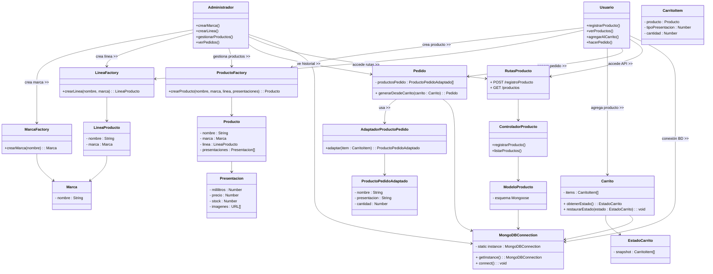

## Patrones de Diseño Implementados

En este proyecto se aplicaron varios patrones de diseño para lograr un backend modular, escalable y mantenible. A continuación se describen cada uno y la razón por la cual fueron elegidos:

### Singleton  
Se utilizó para manejar la conexión única a la base de datos, evitando múltiples conexiones simultáneas y facilitando el control centralizado del acceso a MongoDB.

---

### Factory Method  
Se implementó para la creación de productos, marcas y líneas de producto, facilitando la creación de variantes sin acoplar el código a clases concretas. Esto mejora la escalabilidad y permite agregar nuevas entidades sin modificar el código existente.

---

### Adapter  
Se usó para adaptar diferentes formatos y variantes de productos bajo la misma marca y línea, unificando la forma en que se manejan los datos internamente sin importar sus diferencias originales.

---

### Memento   
Se aplicó para gestionar el estado del carrito de ventas, permitiendo recuperar y actualizar el contenido sin pérdida de datos, mejorando la experiencia de usuario y el control de estados.

---

### VMC (Vista - Modelo - Controlador)    
Se utilizó para estructurar el backend de forma modular y clara, facilitando mantenimiento, pruebas y escalabilidad, evitando código monolítico, favoreciendo el trabajo en equipo y ayudando a que el backend esté mejor organizado para evitar complejidades.

---

## Diagrama UML de Clases UML

Al implementar estos patrones, logré que el backend sea mucho más organizado y fácil de mantener. Cada patrón cumple un propósito claro y juntos permiten que el sistema crezca sin que el código se vuelva un caos difícil de entender. Además, ayudan a que diferentes desarrolladores trabajen en el proyecto sin pisarse entre sí y facilitan la incorporación de nuevas funcionalidades en el futuro.

Este enfoque modular y escalable no solo hace que el desarrollo sea más eficiente, sino que también brinda confianza de que la aplicación podrá evolucionar con menos dolores de cabeza. En definitiva, usar estos patrones me permitió construir una base sólida, pensando en el presente y el futuro del proyecto.
